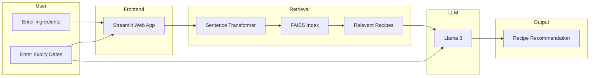
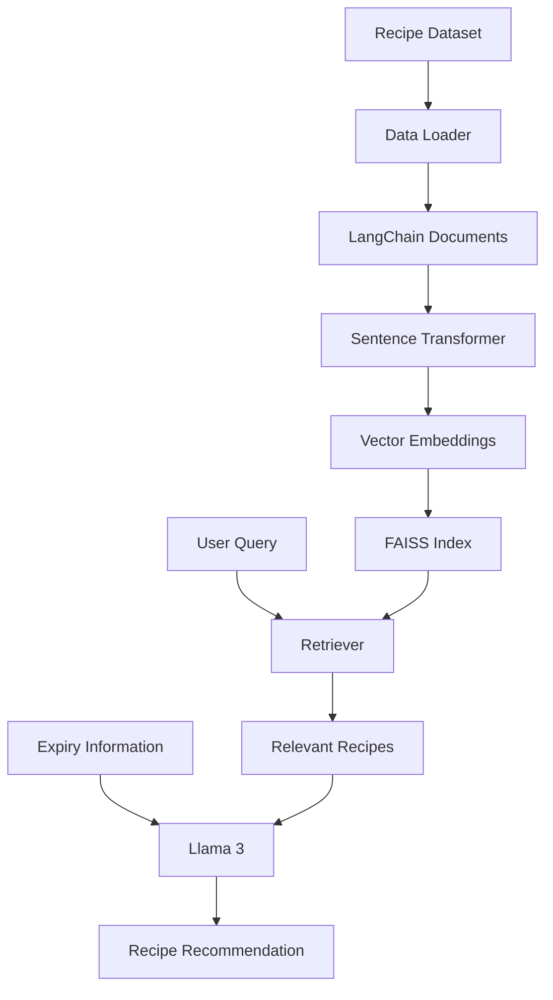
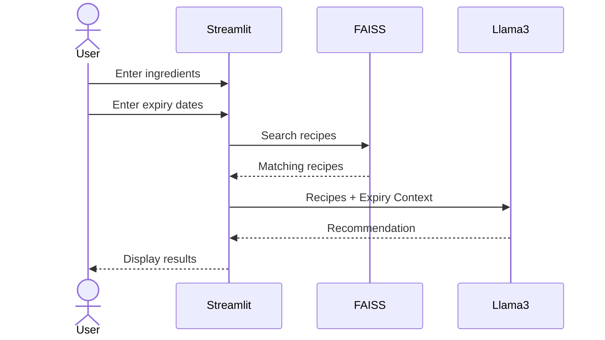

# 🍳 PantryPilot AI

> **Expiry-Aware Recipe Recommendation System using Retrieval-Augmented Generation (RAG)**

PantryPilot AI is an AI-powered recipe recommendation system that uses **Retrieval-Augmented Generation (RAG)** to suggest recipes based on the ingredients available in a user's pantry. It also considers ingredient expiry dates to prioritize recipes that help reduce food waste.

The application combines **semantic search**, **FAISS vector search**, and a **locally hosted Llama 3 model via Ollama** to generate contextual and explainable recipe recommendations.

---

## ✨ Features

- 🥘 AI-powered recipe recommendations
- 📅 Expiry-aware ingredient prioritization
- 🔍 Semantic recipe retrieval using FAISS
- 🤖 Local LLM inference with Llama 3 (Ollama)
- 📚 Knowledge base containing 13,000+ recipes
- 💻 Interactive Streamlit interface
- 🔒 Fully local execution (No API keys required)

---

# 🏛️ System Architecture



---

# 🧠 RAG Pipeline



---

# ⚙️ Application Workflow



---

# 📂 Project Structure

```text
PantryPilotAI/
│
├── app.py
├── README.md
├── requirements.txt
├── pyproject.toml
├── uv.lock
│
├── data/
│   └── 13k-recipes.csv
│
├── faiss_index/
│
├── src/
│   ├── data_loader.py
│   ├── embeddings.py
│   ├── llm.py
│   ├── text_splitter.py
│   └── vector_store.py
│
└── tests/
```

---

# 🛠️ Technology Stack

| Category | Technology |
|----------|------------|
| Language | Python |
| Framework | LangChain |
| UI | Streamlit |
| Vector Store | FAISS |
| Embedding Model | Sentence Transformers |
| LLM | Llama 3 (Ollama) |
| Dataset | 13K Recipes |

---

# 🚀 Installation

### Clone the repository

```bash
git clone https://github.com/Manjot5698/PantryPilotAI.git
cd PantryPilotAI
```

### Create a virtual environment

```bash
uv venv
```

### Activate the environment

**Windows**

```bash
.venv\Scripts\activate
```

**Linux/macOS**

```bash
source .venv/bin/activate
```

### Install dependencies

```bash
uv pip install -r requirements.txt
```

---

# 🤖 Install Ollama

Install Ollama from:

https://ollama.com

Pull the required model:

```bash
ollama pull llama3
```

---

# ▶️ Run the Application

Generate the FAISS index if it does not already exist.

Then launch the Streamlit app:

```bash
streamlit run app.py
```

---

# 💡 Example Input

### Ingredients

```text
milk
tomatoes
chicken
rice
```

### Expiry Days

```text
milk : 1
tomatoes : 2
chicken : 5
rice : 30
```

---

# 🎯 Example Output

```text
Recommended Recipe:
Creamy Tomato Chicken Rice

Reason:
Uses ingredients closest to expiry while matching the available pantry items.

Missing Ingredients:
- Black Pepper
- Parsley

Preparation Time:
30 minutes
```

---

# 🌱 Future Enhancements

- 📷 Fridge image recognition
- 🧾 Receipt OCR
- 🛒 Smart shopping list generation
- 🥗 Nutrition and calorie analysis
- 🌍 Online recipe retrieval
- 🎙️ Voice assistant support
- 👨‍👩‍👧 Multi-user pantry management
- 🤖 LangChain Agents
- 🔔 Automatic expiry notifications

---

# 📖 Motivation

Food waste is a major global challenge, with household kitchens contributing significantly through expired ingredients.

PantryPilot AI addresses this issue by combining semantic search with Retrieval-Augmented Generation (RAG) to recommend recipes that maximize ingredient utilization while minimizing food waste.

Unlike traditional recipe recommendation systems, PantryPilot AI incorporates ingredient expiry information into the recommendation process, helping users make smarter cooking decisions.

---

# 📄 License

This project is intended for educational, research, and portfolio purposes.