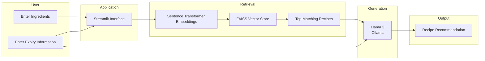
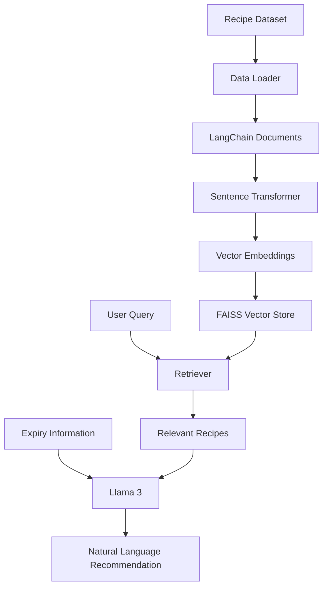
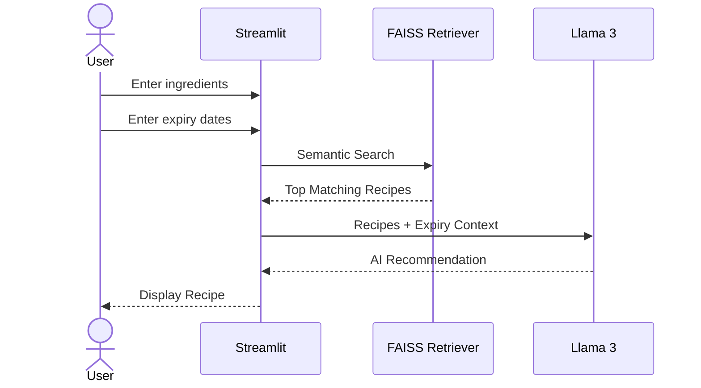

````markdown
# 🍳 PantryPilot AI

> **Expiry-Aware Recipe Recommendation System using Retrieval-Augmented Generation (RAG)**

PantryPilot AI is a Retrieval-Augmented Generation (RAG) application that intelligently recommends recipes based on the ingredients available in a user's pantry. Unlike traditional recipe recommendation systems, PantryPilot also considers ingredient expiry dates to prioritize recipes that help reduce food waste.

The system combines **semantic search**, **vector databases**, and a **locally hosted Large Language Model (LLM)** to deliver contextual, explainable recipe recommendations.

---

## ✨ Features

- 🥘 AI-powered recipe recommendations
- 📅 Expiry-aware ingredient prioritization
- 🔍 Semantic recipe retrieval using FAISS
- 🤖 Local LLM inference with Llama 3 via Ollama
- 📚 Knowledge base of 13,000+ recipes
- 💻 Interactive Streamlit web interface
- 🔒 Fully local execution (No API keys required)

---

# 🏛 System Architecture



---

# 🧠 Retrieval-Augmented Generation Pipeline



---

# ⚙️ Application Workflow



---

# 📂 Project Structure

```text
PantryPilot/
│
├── app.py
├── README.md
├── requirements.txt
├── pyproject.toml
│
├── data/
│   └── 13k-recipes.csv
│
├── faiss_index/
│
├── src/
│   ├── data_loader.py
│   ├── embeddings.py
│   ├── llm.py
│   ├── text_splitter.py
│   └── vector_store.py
│
└── tests/
```

---

# 🛠 Technology Stack

| Category | Technology |
|-----------|------------|
| Programming Language | Python |
| Framework | LangChain |
| User Interface | Streamlit |
| Vector Database | FAISS |
| Embedding Model | Sentence Transformers |
| Large Language Model | Llama 3 (Ollama) |
| Dataset | 13K Recipes Dataset |

---

# 🚀 Installation

## Clone the repository

```bash
git clone https://github.com/<your-username>/PantryPilot.git

cd PantryPilot
```

## Create a virtual environment

```bash
uv venv
```

### Activate the environment

**Windows**

```bash
.venv\Scripts\activate
```

**Linux / macOS**

```bash
source .venv/bin/activate
```

## Install project dependencies

```bash
uv pip install -r requirements.txt
```

## Install Ollama

Download Ollama from:

https://ollama.com

Pull the required model:

```bash
ollama pull llama3
```

---

# ▶️ Running the Application

If the vector database has not been generated yet, create the FAISS index first.

Launch the application:

```bash
streamlit run app.py
```

---

# 💡 Example Usage

### Available Ingredients

```text
milk, tomatoes, chicken, rice
```

### Expiry Information

```text
milk:1
tomatoes:2
chicken:5
rice:30
```

### User Query

```text
I want to cook dinner tonight. What should I make?
```

---

# 🎯 Sample Recommendation

```text
Recommended Recipe:
Creamy Tomato Chicken Rice

Reason:
This recipe is recommended because it makes use of milk and tomatoes,
which are closest to their expiry dates, while matching most of the
ingredients currently available in your pantry.

Missing Ingredients:
• Black Pepper
• Parsley

Estimated Preparation Time:
30 Minutes
```

---

# 🌱 Future Enhancements

- Fridge image recognition
- Receipt OCR for automatic inventory management
- Smart shopping list generation
- Nutrition and calorie analysis
- Dietary preference support
- Online recipe retrieval
- Voice interaction
- Multi-user pantry management
- Agentic workflow using LangChain Agents
- Automatic expiry notifications

---

# 📖 Motivation

Food waste is a significant global issue, and one of its major contributors is unused ingredients expiring in household kitchens.

PantryPilot AI addresses this problem by combining semantic search with Retrieval-Augmented Generation to recommend recipes that maximize ingredient utilization while minimizing food waste.

Unlike conventional recipe recommendation systems, PantryPilot introduces **expiry-aware decision making**, enabling users to prioritize ingredients that should be consumed first.

---

# 📄 License

This project is intended for educational, research, and portfolio purposes.
````
